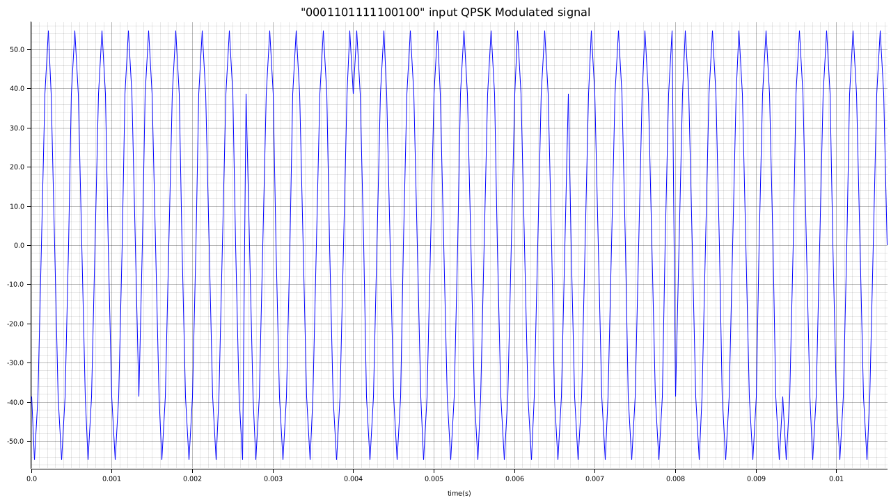

# QPSK Modulator

QPSK modulator built in Rust for an assignment for Digital Circuit Laboratory course offered by the University of the Basque Country as part of their Master’s Degree in Telecommunication Engineering.

## Table of Contents

-   **[Info](#info)**
    -   [QPSK modulation](#qpsk-modulation)
    -   [Inputs](#inputs)
    -   [Outputs](#outputs)
-   **[Setup](#setup)**
    -   [Rust Installation - Ubuntu](#rust-installation---ubuntu)
-   **[Run](#run)**
-   **[Debugging](#debugging)**

## Info

### QPSK modulation

QPSK (Quadrature Phase Shift Keying) is a digital modulation scheme that uses four different phase angles to transmit two bits of digital information at a time. In this modulation scheme, the carrier wave is shifted by 0, 90, 180, or 270 degrees in each symbol interval, with each phase shift representing a different combination of two bits (00, 01, 10, or 11).

QPSK is a form of quadrature modulation, which means that it uses two carriers that are 90 degrees out of phase with each other. These two carriers are used to transmit the in-phase (I) and quadrature (Q) components of the signal. By manipulating the phase of these two carriers, QPSK can transmit two bits per symbol, doubling the data rate compared to BPSK (Binary Phase Shift Keying), which can transmit only one bit per symbol.

QPSK is widely used in many digital communication systems, including satellite and wireless communication systems, due to its high data rate and robustness to noise and interference. However, QPSK requires more complex demodulation and decoding techniques than BPSK, which can increase the complexity and cost of the receiver.

The functional block diagram used to create the program can be found in the next image:


### Inputs

Once the program is started the user will be prompted to enter the following inputs:

-   **Sample frequency:** (samples/sec): Frequency in witch the incoming bits will be sampled for creating the output analog signal.
-   **Carrier frequency** (sample/sec): Frequency of the carriers used for creating the phi signals for modulating the demultiplexed NRZ encoded incoming signals.
-   **Symbol rate** (symbol/sec): Rate of the incoming bit information.
-   **Bits that are going to be modulated** (bit array): Value of incoming bits that are going to be modulated.

### Outputs

Once the program creates the samples of the QPSK modulated signal, the samples are exported in the following way:

-   **QPSK_signal_plot.png**: Plot of the modulated qpsk signal directly generated by the program. Example of a plot:
    
-   **QPSK_signal_samples.csv**: CSV file where every line in the file corresponds to the samples of each symbol of the bit array entered by by the user. For example, if the "0001101111100100" bit has ben entered the file is formed the following way:
    -   00 symbol -> new line: 38.72983346207417,-54.77225575051661,-38.72983346207418...
    -   01 symbol -> new line: -38.72983346207448,-0.0000000000005861977570020827,38.72983346207365..
    -   10 symbol -> new line: 38.72983346207287,-0.000000000002078337502098293,-38.72983346207581...
    -   11 symbol -> new line: 38.72983346207901,54.77225575051661,38.729833462069536...
    -   11 symbol -> new line: 38.72983346207901,54.77225575051661,38.729833462069536...
    -   10 symbol -> new line: 38.72983346207287,-0.000000000002078337502098293,-38.72983346207581...
    -   01 symbol -> new line: -38.72983346207448,-0.0000000000005861977570020827,38.72983346207365...
    -   00 symbol -> new line: 38.72983346207417,-54.77225575051661,-38.72983346207418...

## Setup

To start running the program, first you'll need to install Rust and Cargo in your local machine

### Rust Installation - Ubuntu

-   Via API
    It doesn't install rustup so it's recommended if the only reason of cloning the repo is to execute the program the program is to execute it

```bash
sudo apt update
sudo apt install rustc
```

-   Via rustup

```bash
curl --proto '=https' --tlsv1.2 -sSf https://sh.rustup.rs | sh
```

Check if rust is install correctly checking the version once rust is installed

```bash
rustc --version
```

## Run

Now that Rust has been installed, you only have to enter the next command to compile and start running the program:

```bash
cargo run
```

If you need to see the logs of the program or backtrace it in case of any errors, you can use the next options to get more information about the program:

-   RUST_BACKTRACE: Displays an entire backtrace of errors
-   RUST_LOG: Select the log level desired to show in the output (info/warning/error)

```bash
RUST_BACKTRACE=1 RUST_LOG=info cargo run
```

## Debugging

Install rust-analyzer extension in VSCode and you'll be able to debug the program without any more complication

## Dependencies

-   **bit-vec** = "0.6.3": Used for creating bit vectors
-   **csv** = "1.2.1": Used for creating the output CSV file
-   **env_logger** = "0.10.0": Used for implementing basic logging functionality to the program
-   **log** = "0.4.17": As macro frame for env_logger
-   **plotters** = "0.3.4": Used for plotting the QPSK modulated output signal

---

© 2023 by Iker Hernandez. This project is licensed under the MIT License.
Github repository: [https://github.com/ikerhj/qpsk_modulator](https://github.com/ikerhj/qpsk_modulator)

This project has been written in English, because I have few extensions installed to check spelling in English and a one for Basque doesn't exist
